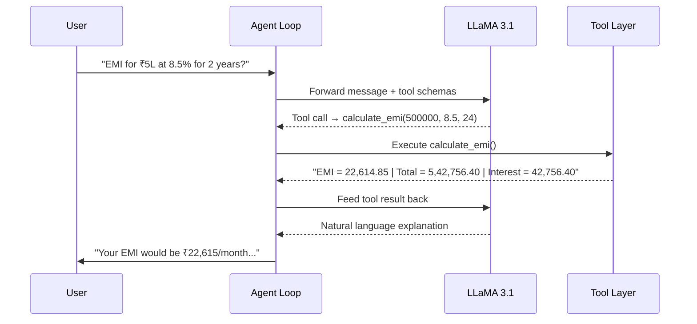

<p align="center">
  <h1 align="center">FinCalc AI</h1>
  <p align="center"><strong>Tool-Augmented Financial Assistant — Accurate Calculations, Zero Hallucinations</strong></p>
</p>

<p align="center">
  
  
  
  
</p>

---

## Overview

Large Language Models are powerful conversational agents — but they **hallucinate numbers**. Ask an LLM to compute a loan EMI and you'll often get a confident, fluently worded, and *completely wrong* answer.

**FinCalc AI** solves this by separating *reasoning* from *computation*:

| Concern | Handled By |
|---|---|
| Understanding the user's question | LLM (LLaMA 3.1) |
| Performing the math | Deterministic JavaScript functions |
| Explaining the result | LLM (LLaMA 3.1) |

The LLM **never fabricates a number**. Every calculation is delegated to a verified JavaScript function via structured **tool calling**, and the result is returned to the model for clear, natural-language explanation.

**Result:** Financial answers you can actually trust.

---

## Key Features

- **Function Calling Architecture** — The LLM invokes typed JavaScript functions instead of guessing arithmetic.
- **5 Financial Calculators** — EMI, Simple Interest, SIP Returns, Loan Amortization, and Max Loan Eligibility.
- **Natural Language I/O** — Ask questions in plain English; get clear, jargon-free explanations.
- **Multi-Turn Context Memory** — Seamlessly recalls user-provided parameters across chat turns.
- **Anti-Hallucination Guardrails** — A strict system prompt ensures the model never manually computes numbers and actively suppresses internal reasoning leakage.
- **Robust Fallback Parsing** — If the model emits a tool call as raw JSON instead of a structured call, the engine still catches and executes it.
- **Output Sanitization** — Leaked JSON, mode labels, and internal artifacts are stripped before the user sees anything.
- **Modular & Extensible** — Add a new financial function in minutes: write the JavaScript tool, add its schema, register it in the tool map.

---

## Architecture

```
┌─────────────────────────────────────────────────────────────────┐
│                         USER INPUT                              │
│             "What's my EMI for a ₹10L loan at 9%?"             │
└────────────────────────────┬────────────────────────────────────┘
                             │
                             ▼
┌─────────────────────────────────────────────────────────────────┐
│                    LLM REASONING LAYER                          │
│                      (LLaMA 3.1 via Ollama)                     │
│                                                                 │
│  • Understands intent           • Selects the right tool        │
│  • Extracts parameters          • Asks for missing info         │
└────────────────────────────┬────────────────────────────────────┘
                             │  Tool Call: calculate_emi(...)
                             ▼
┌─────────────────────────────────────────────────────────────────┐
│                 FUNCTION / TOOL EXECUTION LAYER                 │
│                                                                 │
│  calculate_emi()        compute_interest()                      │
│  calculate_sip_returns()   loan_amortization()                  │
│  max_loan_eligibility()                                         │
│                                                                 │
│  ✓ Deterministic    ✓ Validated inputs    ✓ Formatted output   │
└────────────────────────────┬────────────────────────────────────┘
                             │  Result: "EMI = 20,758.00 ..."
                             ▼
┌─────────────────────────────────────────────────────────────────┐
│                  RESPONSE GENERATION LAYER                      │
│                                                                 │
│  LLM receives the tool result and explains it in plain          │
│  English — no JSON, no function names, no internal details.     │
└────────────────────────────┬────────────────────────────────────┘
                             │
                             ▼
┌─────────────────────────────────────────────────────────────────┐
│                        FINAL RESPONSE                           │
│  "For a ₹10,00,000 car loan at 9% over 60 months, your EMI    │
│   would be ₹20,758/month. Total interest: ~₹2,45,480."         │
└─────────────────────────────────────────────────────────────────┘
```

---

## How It Works



**Step-by-step:**

1. **User asks a financial question** in natural language.
2. **LLM identifies the computation** needed and selects the appropriate function.
3. **Agent engine dispatches the tool call** — either from a structured `tool_calls` response or by parsing JSON leaked in the text (fallback).
4. **JavaScript tool executes** with validated inputs and returns formatted results.
5. **LLM receives the result** and crafts a clear, friendly explanation — no raw numbers, no JSON, no jargon.
6. **Sanitized response** is displayed to the user.

> The agent loop supports up to **3 consecutive tool rounds** per turn, enabling multi-step calculations when needed.

---

## Functions

### `calculate_emi(principal, rate, tenure_months)`

Calculates the **Equated Monthly Installment** for a loan.

| Parameter | Type | Description |
|---|---|---|
| `principal` | `float` | Loan amount (e.g., `500000`) |
| `rate` | `float` | Annual interest rate as a percentage (e.g., `8.5`) |
| `tenure_months` | `int` | Loan duration in months (e.g., `24`) |

**Returns:** EMI per month, total payment, and total interest.

```python
>>> calculate_emi(500000, 8.5, 24)
"EMI = 22614.85 per month | Total payment = 542756.40 | Total interest = 42756.40"
```

---

### `compute_interest(principal, rate, time_years)`

Calculates **Simple Interest** on a principal amount.

| Parameter | Type | Description |
|---|---|---|
| `principal` | `float` | Principal amount (e.g., `100000`) |
| `rate` | `float` | Annual interest rate as a percentage (e.g., `5.5`) |
| `time_years` | `float` | Time period in years (e.g., `3`) |

**Returns:** Simple interest amount and total accumulated amount.

```python
>>> compute_interest(100000, 5.5, 3)
"Simple Interest = 16500.00 | Total amount = 116500.00"
```

---

### `calculate_sip_returns(monthly_investment, expected_return_rate, duration_years)`

Calculates the **future value of a SIP** (Systematic Investment Plan) using compound interest.

| Parameter | Type | Description |
|---|---|---|
| `monthly_investment` | `float` | Monthly SIP amount (e.g., `5000`) |
| `expected_return_rate` | `float` | Expected annual return rate in % (e.g., `12`) |
| `duration_years` | `int` | Investment duration in years (e.g., `10`) |

**Returns:** Total invested, estimated returns (wealth gained), and future value.

```python
>>> calculate_sip_returns(10000, 12, 15)
"Total invested = 1800000.00 | Estimated returns = 3245760.00 | Future value = 5045760.00"
```

---

### `loan_amortization(principal, rate, tenure_months)`

Generates a **loan amortization schedule** with a month-by-month breakdown of principal, interest, and remaining balance.

| Parameter | Type | Description |
|---|---|---|
| `principal` | `float` | Loan amount (e.g., `500000`) |
| `rate` | `float` | Annual interest rate as a percentage (e.g., `8.5`) |
| `tenure_months` | `int` | Loan tenure in months (e.g., `24`) |

**Returns:** EMI summary + schedule (first 12 months and final month).

```python
>>> loan_amortization(500000, 8.5, 24)
"EMI = 22614.85 | Total interest = 42756.40 | Total payment = 542756.40
Month 1: EMI=22614.85, Principal=19073.18, Interest=3541.67, Balance=480926.82
Month 2: EMI=22614.85, Principal=19208.19, Interest=3406.65, Balance=461718.63
..."
```

---

### `max_loan_eligibility(monthly_income, rate, tenure_months, existing_emi=0)`

Calculates the **maximum loan a person can afford** based on income, using the 50% EMI-to-income rule.

| Parameter | Type | Description |
|---|---|---|
| `monthly_income` | `float` | Gross monthly income (e.g., `80000`) |
| `rate` | `float` | Annual interest rate as a percentage (e.g., `8.5`) |
| `tenure_months` | `int` | Desired loan tenure in months (e.g., `240`) |
| `existing_emi` | `float` | *(Optional)* Sum of current monthly EMIs. Default: `0` |

**Returns:** Maximum affordable EMI and maximum eligible loan amount.

```python
>>> max_loan_eligibility(75000, 8.5, 240)
"Max affordable EMI = 37500.00 | Max loan eligibility = 3850000.00 | At 8.5% for 240 months"
```

---

## Tech Stack

| Component | Technology |
|---|---|
| **Frontend** | React, Tailwind CSS |
| **Backend** | Node.js, Express |
| **LLM** | LLaMA 3.1 (8B) |
| **Inference Runtime** | [Ollama](https://ollama.com/) (local HTTP API) |
| **Tool Calling** | Native Ollama tool schemas + regex fallback parser |

---

## Setup Instructions

### Prerequisites

- **Node.js (v16+)** and npm installed
- **Ollama** installed and running ([Download Ollama](https://ollama.com/download))
- **LLaMA 3.1** model pulled locally

### 1. Clone the Repository & Setup LLaMA

```bash
git clone https://github.com/likhitha58/FinCalc-AI.git
cd FinCalc-AI

# Make sure LLaMA 3.1 is pulled and Ollama is running
ollama pull llama3.1
```

### 2. Start the Backend Server

```bash
cd server
npm install
npm start
```
The server will run on `http://localhost:5000`.

### 3. Start the Frontend Client

Open a new terminal window:
```bash
cd client
npm install
npm start
```
The React app will open automatically at `http://localhost:3000`.

---

## Example Usage

### EMI Calculation

```
You: What's my EMI for a ₹10 lakh car loan at 9% for 5 years?

  ⚙  Tool (structured): calculate_emi({"principal": 1000000, "rate": 9, "tenure_months": 60})
  ✓  Result: EMI = 20758.36 per month | Total payment = 1245501.36 | Total interest = 245501.36

Assistant: For a ₹10,00,000 car loan at 9% annual interest over 60 months,
your EMI would be approximately ₹20,758 per month. Over the full tenure,
you'd pay about ₹12,45,501 in total — meaning roughly ₹2,45,501 goes
toward interest.
```

### SIP Returns

```
You: I invest ₹10,000/month in a SIP at 12% for 15 years. What will I get?

  ⚙  Tool (structured): calculate_sip_returns({"monthly_investment": 10000, "expected_return_rate": 12, "duration_years": 15})
  ✓  Result: Total invested = 1800000.00 | Estimated returns = 3245760.00 | Future value = 5045760.00

Assistant: If you invest ₹10,000 every month for 15 years at an expected
annual return of 12%, here's how it looks: you would have invested a total
of ₹18,00,000, and the estimated future value would be approximately
₹50,45,760 — meaning around ₹32,45,760 comes from returns alone.
That's the power of compounding!
```

---

## Future Improvements

- **More Financial Functions** — Tax calculations (old vs new regime), PPF, and FD returns.
- **UI Integration** — Wrap the engine in a Streamlit or Gradio interface for a richer user experience.
- **Better Reasoning Chains** — Enable the model to handle composite queries (e.g., "If I take this loan, how much less can I invest in my SIP?").
- **Real-Time Data** — Integrate APIs to fetch live repo rates or mutual fund NAVs.

---

## Why This Project Matters

When users ask for financial advice or calculations, they expect **accuracy**. An LLM that fluently hallucinates an incorrect EMI isn't just unhelpful — it's potentially harmful. 

By utilizing function calling, **FinCalc AI** bridges the gap between the LLM's incredible natural language capabilities and the strict deterministic accuracy required for financial planning. It builds **trust in AI systems** by ensuring that math is done by calculators, while talking is done by models.

---

<p align="center">
  Built with and for the AI revolution.
</p>
